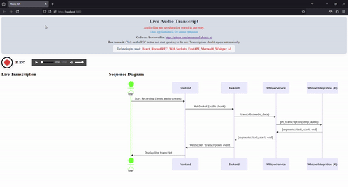

# phonic-api

Live Audio Transcript application that combines real-time audio streaming with AI-powered transcription.

## Project Structure

- **backend/**: Contains the FastAPI backend implementation.

  - **src/**: Main application code.
    - **main.py**: Entry point for the FastAPI application.
    - **api/**: WebSocket routes for real-time communication.
    - **services/**: Integration logic for Whisper AI service.
    - **models/**: Data models for the application.
  - **requirements.txt**: Lists dependencies for the backend.
  - **README.md**: Documentation for the backend.

- **frontend/**: Contains the React frontend implementation.

  - **public/**: Static files for the React application.
    - **index.html**: Main HTML file for the React app.
  - **src/**: Source code for the React application.
    - **App.tsx**: Main component of the React application.
    - **index.tsx**: Entry point for the React application.
    - **components/**: Reusable components for the application.
      - **Recorder.tsx**: Component for capturing audio input.
      - **Transcript.tsx**: Component for displaying live transcription.
    - **services/**: Logic for managing WebSocket connections.
      - **websocket.ts**: Functions to connect and communicate with the backend.
  - **package.json**: Configuration file for npm.
  - **tsconfig.json**: TypeScript configuration file.
  - **README.md**: Documentation for the frontend.

- **ai/**: Contains the integration logic for the Whisper AI service.

  - **whisper_integration.py**: Functions to interact with the Whisper API.
  - **README.md**: Documentation for the AI integration.

## Demo

You can try on: <a href="https://stackedge.dev/portfolio/phonic-ai/" target="_blank">here</a>

A demonstration of the application:  


## Key Features

- Speak into the microphone to see live transcription.
- Save transcripts with timestamps.
- Combines AI with real-time streaming.
- Optimized for low latency (e.g., chunk audio every 2 seconds).

## Setup Instructions

1. Clone the repository.
2. Navigate to the `backend` directory and install dependencies using:
   ```
   pip install -r requirements.txt
   ```
3. Navigate to the `frontend` directory and install dependencies using:
   ```
   npm install
   ```
4. Start the backend server:
   ```
   uvicorn app.main:app --reload
   ```
5. Start the frontend application:
   ```
   npm start
   ```

## Running with Docker Compose

You can run the entire application stack (frontend, backend, ai and Redis) using Docker Compose.
This ensures all services are started and networked correctly for real-time WebSocket communication and AI integration.

### Steps

1. **Build and Start All Services**
   From the root directory (phonic-ai/), run:

   ```
   docker-compose up --build
   ```

   - Build the frontend and backend images.
   - Start the backend (FastAPI + Redis), frontend (React), and Redis services.
   - Expose the frontend on http://localhost:3000 and backend API on http://localhost:8000.

2. **Access the Application**

   - Open your browser and go to http://localhost:3000 to use the app.
   - The frontend will communicate with the backend via WebSockets and the backend will use Redis for rate limiting and session management.

3. **Stopping the Services**
   To stop all running containers, press Ctrl+C in the terminal where Docker Compose is running, then run:

   ```
   docker-compose down
   ```

4. **Access containers**

   ```
   docker exec -it phonic-ai-frontend bash
   docker exec -it phonic-ai-backend bash
   docker exec -it phonic-ai-redis redis-cli
   ```

## Remarks

This project leverages modern web technologies to provide a seamless experience for live transcription using AI.

## Sequence Diagram

The following sequence diagram illustrates the flow of audio transcription in the application:

1. User Interaction:
   The process begins when the User initiates a recording session in the frontend application.

2. **Frontend to Backend:**
   The Frontend captures the audio stream and sends it to the Backend using a WebSocket connection, transmitting audio chunks in real time.

3. **Backend to Whisper Service:**
   The Backend receives the audio data and forwards it to the WhisperService for transcription by calling the `transcribe(audio_data)` method.

4. **Whisper Service to AI Integration:**
   The WhisperService interacts with the WhisperIntegration (AI) component, requesting transcription by invoking `get_transcription(temp_audio)`.

5. **AI Integration Response:**
   The WhisperIntegration (AI) processes the audio and returns the transcription segments, including text and timestamp information, back to the WhisperService.

6. **Transcription Propagation:**
   The WhisperService sends the transcription segments to the Backend, which then emits a WebSocket "transcription" event (or an HTTP response) to the Frontend.

7. **Frontend Display:**
   Finally, the Frontend displays the live transcript, including timestamps, to the User.


## License

[MIT License](https://opensource.org/license/mit)
